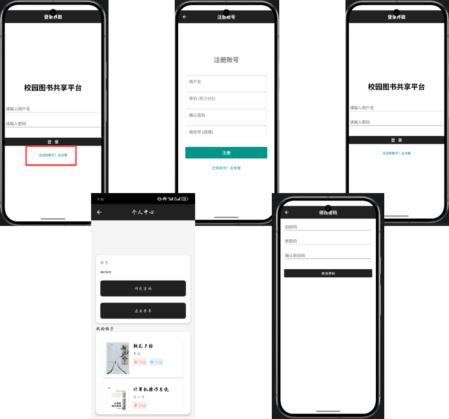
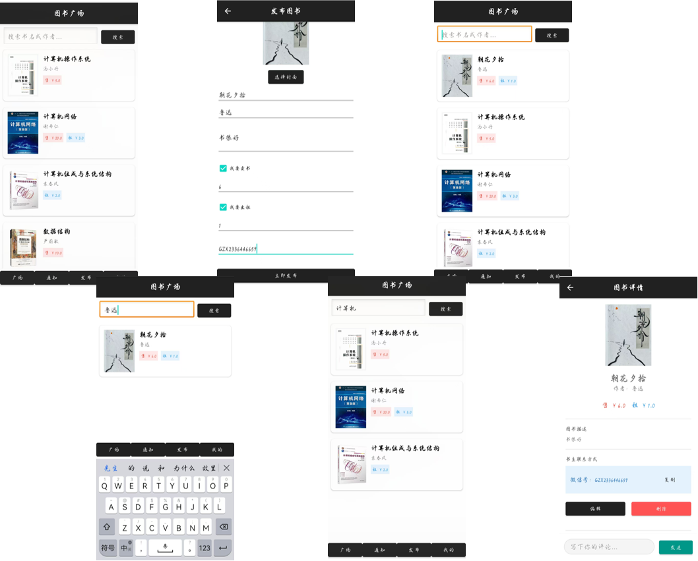
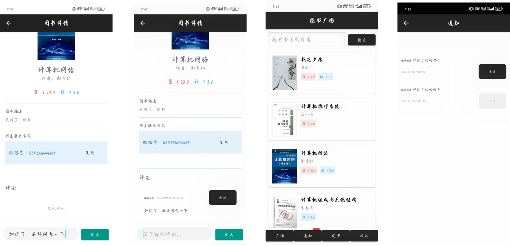

## 实机测试
1、在 CMD 终端输入 ipconfig，查看本机 IPv4 地址

2、打开项目对应文件路径：campus-book-share\android\app\src\main\java\com\example\campus_book_share\network\RetrofitClient.kt

3、将代码中的：

```kotlin
const val BASE_URL = "http://192.168.43.233:8080/"
```

替换为第一步查到的对应 IP，格式示例：

```kotlin
const val BASE_URL = "http://本机IPv4地址:8080/"
```

4、点击 Gradle 中 other 下的 assembleRelease 执行打包

5、打包完成后安装 APK 到手机进行测试

## 项目演示：


